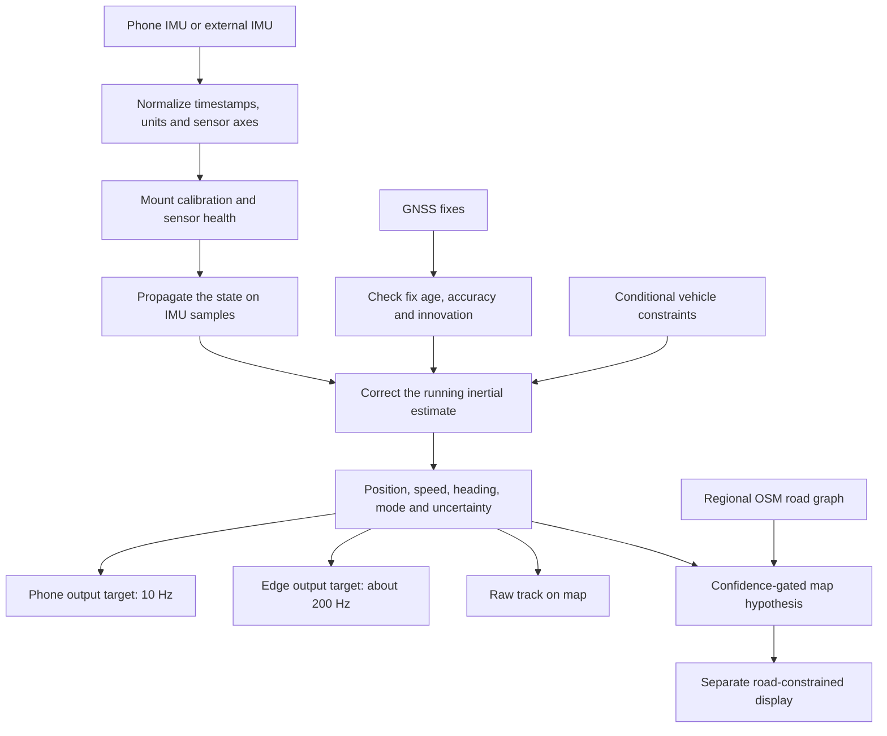

# NAVIS — Navigation AI for Vehicle Inertial Systems

**SIH 26168 prototype for resilient vehicle positioning with a smartphone or an external IMU.**

NAVIS is designed to keep estimating vehicle motion when GNSS becomes weak, stale, or unavailable. It combines inertial propagation, quality-checked GNSS corrections, optional road context, and a map interface. This repository contains a working research prototype and evaluation tools; it is not yet a validated navigation product, and it does not currently meet the stated under-10% drift target.

## The problem

Vehicle navigation commonly depends on Global Navigation Satellite Systems (GNSS). Buildings, tunnels, underpasses, parking structures, foliage, and interference can block or degrade those signals. A map app may then freeze, jump, or lose useful position updates.

A phone still has inertial sensors—principally an accelerometer and gyroscope—which measure motion without receiving satellite signals. But inertial navigation accumulates error: small sensor bias, vibration, pothole impacts, changing phone orientation, and uncertain vehicle speed all affect the estimate. Without corrections, the position can drift substantially during an outage. Phone hardware and mounting positions also vary from vehicle to vehicle.

The engineering challenge is therefore not simply to draw a map when GPS disappears. NAVIS must maintain a trustworthy position estimate, report its uncertainty and source, and avoid presenting a road-snapped guess as measured dead-reckoning accuracy.

## The idea

Keep the map available and keep propagating the vehicle state from IMU measurements. Treat GNSS as a measurement that corrects the ongoing estimate when its age, reported accuracy, and consistency are acceptable. When fixes degrade, reduce their influence; when they become stale, continue in dead-reckoning mode. When good fixes return, accept them gradually while IMU propagation continues.

The estimator needs an initial **position anchor** and a usable heading before inertial propagation can produce a meaningful map position. If the app starts without a location or prior anchor, IMU data alone cannot determine where on Earth the phone is. NAVIS reports that state instead of inventing coordinates.

## The proposed solution



1. **Acquire and timestamp:** Android discovers available sensors and records IMU events and GNSS fixes using event timestamps. The edge adapter accepts external sensor samples with declared units, axes, and clock mapping.
2. **Calibrate and assess quality:** Estimate gyro bias during suitable stationary periods and infer vehicle-frame alignment from gravity and reliable straight motion. Track sensor cadence, gaps, vibration, impacts, and motion quality. Calibration is conditional; it is not a validated universal 3D calibration for every phone mount or road grade.
3. **Propagate continuously:** Integrate the inertial state as IMU samples arrive. Vehicle constraints such as stationary updates and non-holonomic constraints are applied only when their assumptions appear valid.
4. **Fuse GNSS carefully:** Gate fixes by age, reported accuracy, and consistency with the current estimate. The current policy marks stale data degraded and dead-reckoning after a timeout, then requires several consistent fixes and ramps their correction strength during reacquisition. IMU propagation continues throughout.
5. **Display raw and map context separately:** Show the raw navigation estimate and uncertainty. If a regional OpenStreetMap (OSM) road graph is available, a confidence-gated matcher may produce a separate road hypothesis. It can abstain when the match is weak; it must not silently replace the raw estimate or improve the raw drift score.
6. **Publish at the appropriate rate:** The phone targets 10 Hz navigation output for the map. The edge engine is configured for approximately 200 Hz when supplied with a suitably high-rate external IMU. A configured target is not proof of achieved hardware performance.

## What is innovative about the approach

- **One navigation design for two deployments:** The phone and edge engine share state concepts and versioned outputs, while using cadence-appropriate adapters: smartphone sensors and a 10 Hz display path, or external IMU input and a higher-rate edge path.
- **Integrity-aware GNSS transitions:** Fix age, accuracy, and innovation checks help distinguish usable GNSS from stale or inconsistent fixes. Recovery is gradual, and inertial propagation does not stop when GNSS returns.
- **Phone-to-vehicle self-calibration:** The prototype estimates alignment from gravity and suitable vehicle motion rather than assuming a fixed phone orientation. It exposes calibration status and confidence, and refuses some unobservable calibrations.
- **Vibration- and motion-aware filtering:** Signal quality and detected motion events adjust filtering and gate vehicle constraints. These are statistical/physics-based safeguards, not a validated deep-learning fusion system.
- **A learned virtual-speed candidate with promotion safeguards:** A compact model runs locally for diagnostics and offline evaluation. It is deliberately excluded from live fusion because current held-out results do not justify using it as a correction.
- **Map matching that preserves evidence:** Raw dead reckoning remains distinct from an OSM-constrained hypothesis, and road confidence can be rejected. Tunnel and bridge tags are retained for map display.
- **Evidence-first evaluation:** Replay, controlled GNSS-outage experiments, and SUMO-generated scenarios help compare approaches. Simulated or map-aided results are labeled separately from raw inertial results and real hardware measurements.

These are differentiators in this implementation, not claims that the underlying methods are unprecedented.

## What the prototype includes

### Android app

- Live discovery and diagnostics for available phone sensors, including measured event cadence, interval/jitter, sample age, and sensor metadata.
- GNSS status, position/speed/heading output, filter uncertainty, and GNSS-aided/degraded/dead-reckoning modes.
- Interactive, location-following OSM map, route trail, place search, and online routing. Place search uses Photon; online route requests use the public OSRM demo service. These public services require connectivity and do not provide a production availability guarantee.
- Place-name queries are sent to Photon when the user searches. When the user requests an online route, the selected start and destination coordinates are sent to OSRM. Regional offline graph routing is available when a suitable local road graph has been loaded.
- Optional regional OSM road graph download/import for offline vector roads, map matching, and local route planning within that graph's coverage. Online raster map tiles and offline road graphs are different resources: the app does not guarantee a complete offline raster basemap.
- Separate Navigate, Diagnostics, Session, and Benchmark views. Session data is stored on the phone and exported by the user; the app does not automatically upload captures to a cloud service.

### Python navigation and edge core

- Timestamp-ordered planar GNSS/IMU reference filter with quality gates, conditional vehicle constraints, and uncertainty output.
- Vendor-neutral external-IMU adapter for declared units, sensor-to-vehicle rotation, bias, gravity handling, and source-clock mapping.
- JSON Lines edge process and diagnostics for measured cadence, gaps, jitter, and processing latency.
- Optional confidence-gated road matching and learned-speed diagnostic inference.

### Data and experiments

- IO-VNBD inspection, pairing audits, supervised-data preparation, speed-model experiments, and held-out GNSS-outage replay.
- SUMO scenario generation and controlled synthetic outage scripts. SUMO helps produce repeatable simulations; it does not model real GNSS loss unless an outage is explicitly injected, and synthetic data cannot prove phone or FOG hardware performance.

## Current evidence and limitations

**The stated target is under 10% positional drift during GNSS denial. The current project has not achieved it.** The measured held-out IO-VNBD replay reports a **66.6% mean raw IMU + NHC drift** across four test drives, with individual results of approximately **43.6%–80.0%**. The vehicle GNSS/odometry stream is the available reference; it is not surveyed ground truth. Map matching is excluded from the raw-track score.

The offline learned-speed candidate averages **61.6%** on those same held-out outages and remains disabled in live fusion. This result also does not meet the target. SUMO results are synthetic experiments, not real vehicle evidence.

The Android filter and interface have been exercised with a controlled **emulator** outage/reacquisition trace: 169 timestamped outputs over 16.8 seconds at 10.00 Hz, including 60 dead-reckoning states. The emulator remained stationary at a synthetic coordinate, so this validates state-flow and cadence—not driving accuracy or drift. A fresh, safely mounted physical-phone drive and controlled outage capture is still required.

The edge path can be exercised with synthetic 200 Hz input, but there is no genuine 200 Hz FOG capture or target-hardware result in this repository. Phone IMU, 10 Hz IO-VNBD logs, and SUMO-generated signals cannot substitute for that measurement.

Other open limits include full 3D inertial navigation, calibration across phone models and mounts, physical-phone 10 Hz verification on a moving route, real GNSS outage/recovery testing, and broader map/route validation. GNSS loss is not proven to be detected within milliseconds; the current mode policy uses timing thresholds and hysteresis.

## Run the project

### Android

Open the `android/` directory in Android Studio and run the `app` configuration. From PowerShell, with Android Studio's JDK/SDK available:

```powershell
cd android
.\gradlew.bat :app:assembleDebug
```

The debug APK is written to `android/app/build/outputs/apk/debug/app-debug.apk`. Grant location permission, wait for a usable GNSS anchor and heading, then use the map and diagnostics views. A regional offline road graph is optional for raw positioning; it is needed for offline road context and local graph-based routing.

### Python core and replay tools

Use Python 3.10 or later:

```powershell
python -m venv .venv
.\.venv\Scripts\Activate.ps1
python -m pip install -r requirements.txt
```

Run the default held-out outage replay (after the IO-VNBD data has been prepared locally):

```powershell
python scripts/replay_iovnbd_outage.py
```

Install and run the edge JSONL process:

```powershell
python -m pip install -e .
Get-Content sensor-events.jsonl | seamlessnav-edge --config config/edge.example.json
```

For SUMO experiments, install SUMO and make its executables available on `PATH`, then run:

```powershell
python scripts/run_sumo_demo_suite.py
```

See the linked documentation below for data preparation, configuration, assumptions, and evaluation commands.

## Evaluation rules

- State the exact drift metric and denominator. Report endpoint error, trajectory RMSE, and maximum horizontal error separately where possible; do not mix them into one number.
- Compare raw IMU, conditional constraints, learned-speed candidate, GNSS/INS, and map hypothesis on the same held-out outage intervals.
- Split data by drive/session. Keep synthetic SUMO scenarios in training or clearly labeled simulation evaluation, not in the real held-out test set.
- Report update cadence from timestamps and processing latency from measurements. Distinguish sensor input rate from navigation output rate.
- Identify the reference source and its accuracy. Label IO-VNBD vehicle GNSS/odometry as an imperfect onboard reference, not surveyed ground truth.
- Never present synthetic demo values as measured performance or road-snapped positions as raw dead-reckoning accuracy.

## Repository guide

- [`android/README.md`](android/README.md) — Android app behavior, setup, capture/export, and phone limitations.
- [`navcore/README.md`](navcore/README.md) — Python fusion core and external-IMU adapter contract.
- [`docs/ARCHITECTURE_IMPLEMENTATION_20260929.md`](docs/ARCHITECTURE_IMPLEMENTATION_20260929.md) — latest implementation evidence and runtime flow.
- [`docs/SOLUTION_ARCHITECTURE.md`](docs/SOLUTION_ARCHITECTURE.md) — requirements, feature-status matrix, and architecture rationale.
- [`docs/IMPLEMENTATION_PRIORITY_AUDIT.md`](docs/IMPLEMENTATION_PRIORITY_AUDIT.md) — measured gaps and priorities.
- [`docs/IO_VNBD_OUTAGE_V0.md`](docs/IO_VNBD_OUTAGE_V0.md) and [`docs/SPEED_MODEL_V0.md`](docs/SPEED_MODEL_V0.md) — baseline replay and speed-model results.
- [`docs/OFFLINE_MAP_MATCHING.md`](docs/OFFLINE_MAP_MATCHING.md) — OSM graph preparation and map-matching behavior.
- [`docs/SUMO_SYNTHETIC_TRAINING.md`](docs/SUMO_SYNTHETIC_TRAINING.md) — SUMO experiment workflow and simulation safeguards.

## Dataset note

IO-VNBD is obtained from the [upstream repository](https://github.com/onyekpeu/IO-VNBD). Keep downloaded raw data local and do not commit or redistribute it. Review the upstream terms before sharing data or derived artifacts; confirm licensing with the provider where needed.
