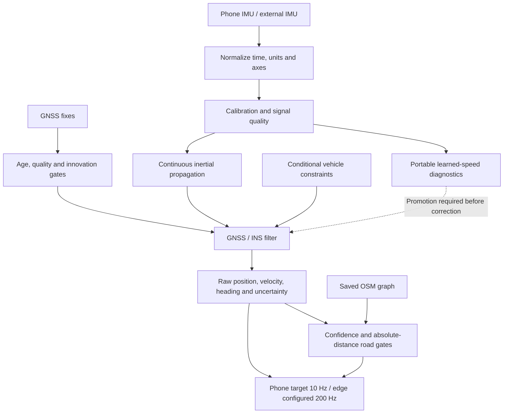

# Navigation implementation — 29 September 2026

This delivery adds a working map interface, a portable learned-speed candidate,
vehicle-frame calibration, and an installable edge process. It does **not**
establish the under-10% drift requirement, validated AI fusion, arbitrary-road
3D alignment, or genuine 200 Hz FOG operation.

## Delivered components

| Component | Implementation | Evidence / limit |
|---|---|---|
| Final Android smoke trace | IMU continued through a controlled emulator GNSS outage; state returned through reacquisition to GNSS aided | 169 timestamped output rows over 16.8 s: exactly 10.00 Hz, median/p95/max intervals all 100 ms, no reversals. Contains 60 DR states. Emulator stayed stationary at a synthetic coordinate, so this tests logic and cadence, not positional drift while driving. |
| Android map | Location-following OSM tiles, pan, pinch/zoom, Follow, heading marker, uncertainty circle, raw track, separate accepted road hypothesis | Built and viewed on the emulator at a synthetic London location. No physical phone was connected. |
| Offline roads | Download a user-requested 3 km-wide regional graph around a recent GPS fix, or import a prepared graph; save atomically and restore on launch | Regional download succeeded after an initial public-service HTTP 504. Vector road view works from the saved graph. It does not download offline raster tiles. |
| Road semantics | Road names, directed connectivity, one-way handling, tunnel, bridge and layer retained | Kotlin conversion checks cover structures and reverse one-way direction. Tunnel dashed amber, bridge blue. |
| Matching | HMM-style continuity with confidence abstention; additional absolute distance/uncertainty gate | Rejects a lone road 24 m from a 1 m-uncertainty observation even if relative confidence is high. Raw position is never overwritten by a road hypothesis. |
| Sensor handling | Live sensor discovery, callback rates, interval/jitter/age diagnostics, motion quality, shock limits and quality-dependent forward acceleration smoothing | Continuous physical navigation remains heuristic/physics based. Low IMU activity alone cannot declare a previously moving car stopped during an outage. |
| Mount calibration | Signed straight-motion acceleration plus gravity estimates a proper sensor-to-vehicle rotation; exposes confidence, matrix and Euler angles | Synthetic checks cover six mount rotations, no-excitation refusal and mount-shift reset. Gravity defines vehicle-up: near-level road assumption; no universal slope/mount validation. |
| Learned speed | Small invariant-feature MLP and learned speed measurement variance execute locally on Android and Python | Exact Python/Kotlin fixture parity. Diagnostic candidate only; bundled `eligible_for_fusion` is false. |
| GNSS/INS | GNSS quality/innovation checks, stale-fix handling, heading-gated IMU propagation and gradual reacquisition | IMU position propagation starts only after a GNSS-course or calibrated vehicle-heading reference exists. Policy uses 1.5 s degraded / 3 s DR thresholds. Degraded status stays latched until three consecutive accepted fixes at 12 m accuracy or better; returning fixes ramp measurement variance 9x → 4x → 1x. This is not millisecond detection of physical RF loss. |
| Phone output | Source-timestamp-driven 100 ms publication target; duplicate state queuing removed | Actual cadence is recorded, not assumed from the target. Long IMU gaps increase process noise. Phone measurement still requires a new mounted real-device capture. |
| Edge process | Installable Python wheel and JSONL input/output service; unit/frame/clock adapter, quality constraints, optional road matching and learned-speed diagnostics | Synthetic integration checks cover 200 Hz input/output and automatic mode transitions. No genuine 200 Hz sensor or target-hardware claim. |
| Output contract | `seamlessnav-navigation-v1` JSONL on Android and edge | Position, velocity, heading, uncertainty, GNSS age/mode, calibration and separate map/model fields. Android ZIP now includes navigation JSONL alongside CSV and profile. |

## Runtime flow



GNSS returns correct the ongoing IMU estimate; they do not switch the IMU off.
The map can be browsed before initialization, but a preview centre is never an
absolute vehicle position. Fresh network location may centre the display and
is labelled separately; it is not fused as GNSS. A location foreground service
now keeps the live Activity-owned session running while the app is paused so
the user can check another map app; returning to SeamlessNav resumes the same
capture. Activity/process-destruction recovery is not implemented, and physical
phone background cadence still needs verification. There is no automatic cloud
upload or replacement of another app's system location. A route can be planned
by tapping a destination over the loaded regional OSM graph; turn and remaining
distance guidance are shown separately from raw DR. Routing outside that
regional graph is rejected rather than guessed.

## Model and dataset evidence

The new model was trained on the existing audited IO-VNBD preparation: 40 training,
20 validation and four held-out test drives. The original clock audit excluded
eight of the 72 paired drives. This uses the full eligible prepared corpus;
it does not pretend that every raw file is suitable training data.

Input is 20 samples at 10 Hz, with accelerometer, gravity, linear acceleration
and gyro magnitudes. Mean, standard deviation, min, max and last values produce
20 features. A 24-unit tanh hidden layer estimates absolute forward speed;
a learned log-variance head supplies experimental uncertainty. Magnitudes remove
dependence on axis naming, but discard useful direction information and cannot
make speed universally observable from IMU alone.

Android and the edge streaming wrapper use completed 100 ms magnitude bins,
discard windows across gaps and run inference at about 10 Hz. The prepared
IO-VNBD stream is nominally 10 Hz; transfer from its instantaneous samples to
phone bin averages and from phones to external IMUs still needs real validation.

Held-out absolute-speed MAE: **6.641 m/s**; RMSE: **8.333 m/s**. A training-median
constant predictor has RMSE **10.055 m/s** on the same windows. This candidate
does not beat the previously reported absolute-speed ridge MAE of about 5.94 m/s;
its value here is an executable portable inference path, not a state-of-the-art claim.

The same previously selected four 60 s outage windows were replayed with a
separate what-if filter branch. It admits an in-domain prediction at most once
per second and inflates its variance 4x because it shares the propagation IMU.
No test-drive result was used to retune this model or its gates.

| Held-out drive | Raw IMU + NHC endpoint drift | With portable candidate |
|---|---:|---:|
| S1 | 79.98% | 79.45% |
| S2 | 73.51% | 67.22% |
| S3a | 43.56% | 61.97% |
| S3c | 69.26% | 37.74% |
| Mean | **66.58%** | **61.60%** |

Three drives improve, one worsens; **none meets 10%**. The earlier speed-change
and SUMO augmentation candidates remain rejected. The new artifact also remains
disabled for live fusion. These repeatedly inspected test drives should be
supplemented with fresh unseen routes for the eventual promotion decision.
Pre-outage calibration uses the paired vehicle reference, and the reference
trajectory is onboard GNSS/odometry, not surveyed truth. Map matching is excluded
from these drift scores.

Artifacts: `outputs/portable_speed_v1/metrics.json`, `model.json`, and
`outputs/portable_speed_outages/summary.json` with per-drive CSV/plots.

## Run and inspect

Android APK: `android/app/build/outputs/apk/debug/app-debug.apk`.
Install it, allow precise location, acquire an outdoor GPS anchor and let the
foreground session run. Use **Download roads around my location** once while
online, then **Offline road map** for the saved regional vector layer. The
download dialog explains the area coordinates sent to the public data service.
An offline region has finite coverage; prepare another region when necessary.

Build and check:

```powershell
$env:JAVA_HOME='D:\APPS\Android studio\jbr'
.\android\gradlew.bat -p android :app:testDebugUnitTest :app:assembleDebug :app:lintDebug
python scripts/validate_navigation_contracts.py
python scripts/summarize_navigation_jsonl.py capture_navigation.jsonl --output cadence.json
```

The seven Kotlin checks cover inference parity, causal bins/gap reset, calibration,
unobservable calibration refusal, OSM structure/one-way conversion, incomplete
downloads, and off-road match rejection. Lint has no blocking errors; existing
localization and other warnings are not all resolved.

Edge installation and launch:

```powershell
python -m pip install outputs/architecture_validation/wheels/seamlessnav_edge-0.4.0-py3-none-any.whl
Get-Content sensor-events.jsonl | seamlessnav-edge --config config/edge.example.json --model outputs/portable_speed_v1/model.json
```

The process accepts one JSON object per line, emits versioned JSONL and flushes
each output. Use a vendor SDK/serial reader to feed the same stdin pipe. It is
a local process interface, not a network server. Configure actual sensor axes,
units, bias, gravity and clock mapping; the example assumes an already aligned
SI sensor. For changing attitude, supply the correct per-sample gravity in SI.

Example event types (events must use a consistent monotonic clock; propagate
the IMU through a GNSS timestamp before supplying that GNSS fix):

```json
{"type":"imu","timestamp":1000000000,"acceleration":[0,0,9.80665],"angular_rate":[0,0,0],"quality":1,"normal_driving":true,"stationary":false}
{"type":"gnss","timestamp_ns":1000000000,"latitude_deg":51.5,"longitude_deg":-0.12,"horizontal_sigma_m":3,"speed_mps":10,"heading_deg_north_clockwise":0}
```

`normal_driving` and `stationary` default to false on the edge boundary: a vendor
adapter must supply supported evidence instead of enabling NHC/ZUPT blindly.
Optional `--roads` takes the same offline graph format as Android. Map hypotheses
update at most 10 Hz while raw edge states follow the configured sensor cadence.
No rate is manufactured by upsampling. `--model` reports candidate diagnostics;
the edge service does not apply them to fusion.

## Remaining evidence and engineering

1. New mounted physical-phone route: measured input/output rates, callback gaps,
   alignment, time synchronization, outage/recovery and battery/latency.
2. Calibration on grades, turns and different phone/holder combinations; current
   navigation is planar and does not constitute a complete 3D INS.
3. Better held-out integrated drift, calibrated learned uncertainty and fresh
   routes before activating learned pseudo-measurements or claiming AI fusion.
4. Genuine high-rate external IMU/FOG capture and timing on the intended edge
   device. Synthetic timestamps establish protocol behavior only.
5. Regional map coverage, missing/wrong OSM roads, complex junctions and route
   transitions. Relative matcher confidence is not an integrity guarantee.

## Primary references for implementation

- [OSM standard tile service policy](https://operations.osmfoundation.org/policies/tiles/): visible attribution, app User-Agent, cache handling, no offline bulk tile prefetch.
- [Overpass API](https://wiki.openstreetmap.org/wiki/Overpass_API): user-requested regional OSM data, independent of raster tiles.
- [Android motion sensors](https://developer.android.com/develop/sensors-and-location/sensors/sensors_motion): platform sensor inputs and coordinate conventions.
- [Android Location](https://developer.android.com/reference/android/location/Location): elapsed-time, accuracy, speed and bearing fields.
- [IO-VNBD](https://github.com/onyekpeu/IO-VNBD): source dataset used for training and replay.

The user-provided SIH requirements remain the acceptance target; this document
does not assert ISRO certification, endorsement or benchmark acceptance.
