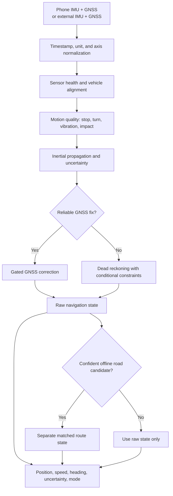
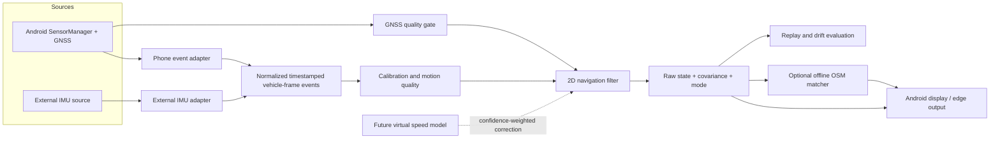
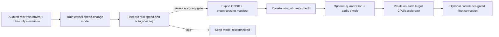

# Seamless Vehicle Navigation — Project Documentation

**Project:** SIH 26168  
**Scope:** Smartphone and external-IMU navigation during weak or unavailable GNSS  
**Status:** Working prototype and evaluation pipeline; navigation accuracy target remains unverified

## 1. Problem

Vehicle navigation based only on GNSS can become unreliable in tunnels, urban canyons, covered roads, and other areas with poor satellite visibility. A phone can continue estimating movement with its inertial sensors, but small errors in acceleration, heading, timing, and phone placement accumulate rapidly. A vehicle-mounted external IMU offers another input path, yet it may run at a very different sampling rate from a phone.

The challenge is to keep reporting a useful position and an honest confidence estimate through a GNSS outage, then return smoothly to GNSS when reliable fixes resume. The SIH brief sets a target of **less than 10% position drift relative to distance travelled** during GNSS denial, with a **10 Hz phone output** and an approximately **200 Hz external FOG-IMU path**. The precise drift statistic should be confirmed with the organizers; endpoint error, maximum error, and trajectory RMSE should all be reported.

## 2. Idea

Build an **edge-first, sensor-neutral navigation engine** that combines physics-based inertial propagation with quality-aware corrections. The phone app and external-IMU adapter supply normalized, timestamped measurements to the same navigation concept. GNSS anchors the estimate when trustworthy; vehicle-motion constraints and, eventually, a small learned virtual speed sensor help during outages. An optional offline road matcher supplies a separate, confidence-gated route estimate.

The system reports its operating mode and uncertainty along with position. It also preserves the raw inertial/GNSS track so a road-matched display cannot conceal the underlying dead-reckoning error.

## 3. Solution

1. **Acquire and normalize sensor data.** Discover available phone sensors at runtime or accept an external IMU through an adapter. Convert units, axes, and timestamps to a declared common frame and clock; monitor actual sample rate and gaps.
2. **Align the phone to the vehicle.** Estimate stationary gyro bias and tilt, then use reliable motion and GNSS course to infer a phone-to-vehicle heading offset. Lower confidence if alignment is weak or the mount moves.
3. **Estimate motion and sensor quality.** Detect stops, turns, vibration, and impacts. Use these signals to adjust filter noise and decide when vehicle constraints are safe.
4. **Propagate the navigation state.** Integrate vehicle-forward acceleration and yaw rate between GNSS fixes. Track position, speed, heading, and uncertainty. Apply zero-velocity and non-holonomic constraints only when supported by motion quality.
5. **Fuse GNSS carefully.** Use fix age, reported accuracy, and disagreement with the predicted state to accept or down-weight a GNSS update. Continue dead reckoning during outages and reconcile the estimate when reliable GNSS returns.
6. **Offer optional offline road matching.** Compare the estimated track to a local OpenStreetMap road graph, retain multiple route candidates, and abstain when confidence is low. Keep matched and raw tracks distinct.
7. **Evaluate on held-out drives.** Replay known GNSS outages, compare against an independent reference where available, and report drift, output cadence, and latency for each deployment path.

**Current implementation:** The Android app records phone IMU/GNSS data and runs a Kotlin 2D navigation filter with GNSS-aided and dead-reckoning modes. A Python reference filter, external-IMU normalization adapter, and offline OSM matcher exist. The learned speed model is an offline candidate and is **not** connected to live navigation. A real moving-route/outage validation and a genuine 200 Hz FOG test are still needed.

## 4. Innovation

| Proposed differentiator | Why it matters | Current state |
|---|---|---|
| Confidence-aware virtual speed sensor | Predict short-term speed change and uncertainty from IMU windows, then let the filter reduce its influence when the signal is poor. | Research direction; current ridge speed baseline is too weak for fusion. |
| Motion-conditioned vehicle constraints | Use stop and sideways-motion constraints only during suitable driving, avoiding false corrections during shocks or possible slip. | Initial heuristic gates feed the phone filter; road validation is pending. |
| Self-checking mount alignment | Adapt to different phone orientations and detect when a mount changes. | Initial tilt, gyro-bias, and GNSS-course estimates exist; full 3D alignment is pending. |
| Integrity-aware GNSS transitions | Reject implausible fixes and avoid abrupt state changes after an outage. | Basic GNSS update/mode logic exists; stronger hysteresis and reacquisition testing are pending. |
| Evidence-preserving map matching | Improve route presentation without claiming that map snapping fixed raw inertial drift. | Python HMM plus Android import and separate display-only road hypothesis; local map and route tests are pending. |
| Shared design across two rates | Reuse a sensor-neutral state/output contract while phone and edge paths propagate at their measured input cadences. | Phone and Python edge prototypes exist; 10 Hz live output and 200 Hz external operation have not been verified. |

These are project design choices and hypotheses, not demonstrated benchmark improvements.

## 5. Process flow

**Offline model-development flow:** Audit and synchronize IO-VNBD phone/vehicle pairs → build phone-only input windows with vehicle speed as a training label → add train-only SUMO/CARLA scenarios and simulated device profiles → split real data by complete drive and phone model → train and compare candidates → replay the same held-out real GNSS outages → export and benchmark an ONNX candidate → connect it only if integrated position error improves. The simulation and ONNX stages are proposed; they are not completed in this repository.

## 6. Architecture

The model-development path sits alongside this runtime path: real captures and simulation traces feed a common normalized training schema; the resulting candidate is evaluated on held-out real drives before it can become an optional correction in the filter. Simulation never supplies evaluation ground truth for a real-world accuracy claim.

| Component | Responsibility | Repository location |
|---|---|---|
| Android acquisition and UI | Sensor discovery, timestamped capture, GNSS, export, and live state display | `android/app/src/main/java/org/sih/seamlessnav/MainActivity.kt` |
| Phone signal processor | Initial calibration, motion events, and quality gates | `android/app/src/main/java/org/sih/seamlessnav/VehicleSignalProcessor.kt` |
| Phone navigation engine | Kotlin 2D IMU/GNSS state estimation and 10 Hz output target | `android/app/src/main/java/org/sih/seamlessnav/PhoneNavigationEngine.kt` |
| Reference fusion core | Python 2D filter for replay and algorithm work | `navcore/fusion.py` |
| External-IMU boundary | Units, frame, clock, bias normalization and cadence diagnostics | `navcore/edge.py` |
| Road matcher | Offline OSM graph and confidence-gated route hypotheses | `navcore/map_matching.py` |
| Data and model pipeline | IO-VNBD auditing, labels, baseline training, outage replay, SUMO tooling | `scripts/` |

The Kotlin phone path and Python edge reference currently implement related filter logic; they are **not one shared runtime binary**. The Python reference is planar, using forward acceleration and yaw rate rather than full 3D strapdown inertial navigation. External hardware-specific ingestion and Android map rendering are future integration work.

## 7. Tech stack

| Layer | Technology | Use |
|---|---|---|
| Mobile | Kotlin, Android SDK, `SensorManager`, Android location APIs | Live sensor capture, GNSS updates, phone navigation, and UI |
| Mobile build | Gradle 9.3.1, Android Gradle Plugin 9.1.1, JDK 17 | Android app build; `minSdk` 26, `targetSdk` 35, `compileSdk` 37 |
| Navigation reference | Python 3.10+, NumPy | 2D fusion, external-IMU normalization, replay, and map matching |
| Data analysis | pandas, Matplotlib | IO-VNBD preparation, metrics, and plots |
| Data | IO-VNBD synchronized smartphone/vehicle logs | Phone IMU inputs and vehicle reference/labels; nominally 10 Hz |
| Traffic simulation | SUMO FCD output | Existing scripts generate traffic scenarios and train-only synthetic IMU examples; SUMO runs and metrics are pending |
| Vehicle and sensor simulation, planned | CARLA | Proposed higher-fidelity IMU/GNSS and vehicle-dynamics scenarios; no CARLA integration exists yet |
| Offline maps, optional | OpenStreetMap XML extract converted to local JSON | Regional road graph for offline matching; no extract is bundled |
| Model baseline | Ridge regression implemented in project scripts | Offline speed experiment; not deployed in the app |
| Model deployment, planned | ONNX model format and ONNX Runtime | Proposed portable inference path for Android and external edge devices; no ONNX export/runtime integration exists yet |

## 8. Simulation plan: SUMO and CARLA

Use the two simulators for different coverage, then test every candidate on untouched real drives.

| Source | Role | Planned scenarios and output | Repository status |
|---|---|---|---|
| SUMO | Vary route geometry, traffic density, stop/start cycles, speeds, and turns at scale. | Export vehicle trajectories through FCD; derive phone-like acceleration/gyro windows with randomized mount, bias, noise, vibration, and shocks. | Scenario runner, FCD converter, and real-only versus mixed-training comparison scripts exist. SUMO itself has not been run here. |
| CARLA | Exercise vehicle dynamics and sensor conditions that a traffic trajectory alone cannot express well. | Record synchronized vehicle pose, IMU, GNSS, and scenario metadata; vary turns, road grade, weather/visibility, GNSS noise/outages, sensor placement, and timing. | Proposed only; no CARLA scripts, captures, or metrics exist. |
| Real phone and vehicle logs | Anchor the simulation to measured sensor behavior and provide final evaluation. | Estimate realistic noise, bias, mounting, and sampling distributions from training devices; keep whole real drives and unseen phones for validation/test. | IO-VNBD preparation exists; a multi-phone mounted-driving collection is still needed. |

For each simulated episode, save simulator/version, map, route, seed, time step, sensor configuration, vehicle truth, injected outage interval, and train-only provenance. Convert simulator output to the same units, axis convention, timestamps, and feature cadence used by real data. Match synthetic noise ranges to **training** captures only. CARLA's IMU and GNSS sensors and configurable synchronous/fixed-time stepping support a reproducible sensor pipeline ([CARLA sensor reference](https://carla.readthedocs.io/en/latest/ref_sensors/), [CARLA world settings](https://carla.readthedocs.io/en/latest/python_api/#carla.WorldSettings)); SUMO FCD supplies vehicle trajectories ([SUMO FCD documentation](https://sumo.dlr.de/docs/Simulation/Output/FCDOutput.html)).

The comparison should be real-only versus real+SUMO versus real+CARLA versus real+both, using the **same held-out real drives**. Report speed error and integrated outage endpoint, maximum, and RMSE errors. A simulated improvement is useful for debugging but cannot establish the SIH drift result. Nominal 10 Hz IO-VNBD data or interpolated simulator output also cannot prove a genuine 200 Hz FOG sensor path.

## 9. Different phones and IMU sensors

Android phones can differ in sensor availability, axis/mount orientation, bias, noise, reporting rate, timestamp gaps, and whether gravity/rotation-vector streams are provided. The app already discovers sensors and exports a session profile with device/build information, sensor inventory, registration success, and measured event rates. Android explicitly requires checking availability at runtime; a requested sampling period does not guarantee a delivered rate ([Android sensor overview](https://developer.android.com/develop/sensors-and-location/sensors/sensors_overview)).

The proposed compatibility path is:

1. **Select a capability profile:** accelerometer+gyroscope supports inertial propagation; missing gyroscope triggers a reduced, GNSS-dominant mode; missing accelerometer becomes GNSS-only. Treat magnetometer, gravity, and rotation vector as optional aids, not guaranteed independent measurements.
2. **Normalize each session:** use sensor-event timestamps; map units and axes; estimate delivered cadence, jitter, and gaps; calibrate biases while safely stationary; align phone and vehicle frames during reliable straight motion. Detect mount changes and reduce confidence until realignment.
3. **Prepare model input consistently:** anti-alias and resample the live stream to the model's declared feature rate. A model trained on nominal 10 Hz IO-VNBD windows must not consume 100 Hz Android samples as if they had the same time spacing.
4. **Train for variation:** augment training drives with plausible rotation, mount shifts, bias, noise, rate jitter, vibration, missing channels, and phone-specific quality ranges. Keep simulation and augmentation out of validation/test.
5. **Prove portability:** report results by phone model, mount, delivered IMU rate, and motion type; hold out whole drives and at least one device model. Fall back to physical/GNSS estimation when the device is outside tested profiles or the model is uncertain.

This is a compatibility strategy, not a claim that the current model generalizes across phones. The current Android alignment is an initial heuristic; multi-device validation is pending.

## 10. ONNX model path for edge deployment

The proposed learned component is a small causal IMU-window model that predicts forward speed change **and confidence**. It is a correction to the physical filter, not a direct latitude/longitude generator. ONNX would let the same model artifact be loaded by a compatible Android or external edge runtime, while each deployment retains its own sensor adapter and high-rate propagation loop. ONNX Runtime documents both mobile deployment and model quantization ([mobile deployment](https://onnxruntime.ai/docs/tutorials/mobile/), [quantization](https://onnxruntime.ai/docs/performance/model-optimizations/quantization.html)).

The artifact contract should record channel order, SI units, vehicle-frame convention, window duration, feature rate, normalization values, missing-sensor mask, output scale/uncertainty, training-data version, and ONNX/opset version. Verify exported and quantized outputs against the training implementation on fixed real windows, including uncertainty and extreme inputs. Measure p50/p95 inference latency, memory, model size, and dropped deadlines on each target; use an execution provider supported by that hardware. Keep inference asynchronous to the external IMU loop so a slower model update does not throttle 200 Hz propagation. The filter should ignore late, invalid, or low-confidence predictions and continue with its physical estimate.

**Status:** No ONNX model, quantization result, ONNX Runtime dependency, Android integration, or edge-device inference benchmark is present yet. The current corrected ridge baseline fails the eligibility gate and should not be exported as a navigation-ready model.

## 11. Evidence and next validation

The synchronized IO-VNBD pipeline currently admits **64 of 72** phone/vehicle pairs after clock checks, yielding **726,618 phone samples**. The corrected held-out speed baseline reaches **5.94 m/s test MAE** but has **R² = -0.78** on the test drives. A 59.9 s simulated GNSS outage on S1 covers 348.2 m of reference travel; the current constrained inertial baseline ends **458.9 m** from the vehicle-GNSS reference (**131.8%** of distance). This does **not** meet the under-10% target. The reference is onboard vehicle GNSS, not surveyed truth.

The next proof points are a safely mounted moving phone capture with measured 10 Hz output and outage/reacquisition behavior, a genuine external high-rate IMU replay with cadence and latency measurements, multi-phone held-out testing, and repeated drive-held-out drift evaluations. SUMO and CARLA scenarios can improve training coverage after their parameters are calibrated to real captures. An ONNX candidate should enter navigation only after real outage improvement and target-device latency/parity checks. Model or map corrections should be introduced only with separate raw and corrected metrics.

## Source notes

This document is based on the repository's current implementation and the detailed notes in `README.md`, `docs/SOLUTION_ARCHITECTURE.md`, `docs/IMPLEMENTATION_PRIORITY_AUDIT.md`, and the component documentation. The two ChatGPT share URLs supplied with the request could not be fetched in this environment, so their content has not been represented as a source here.
